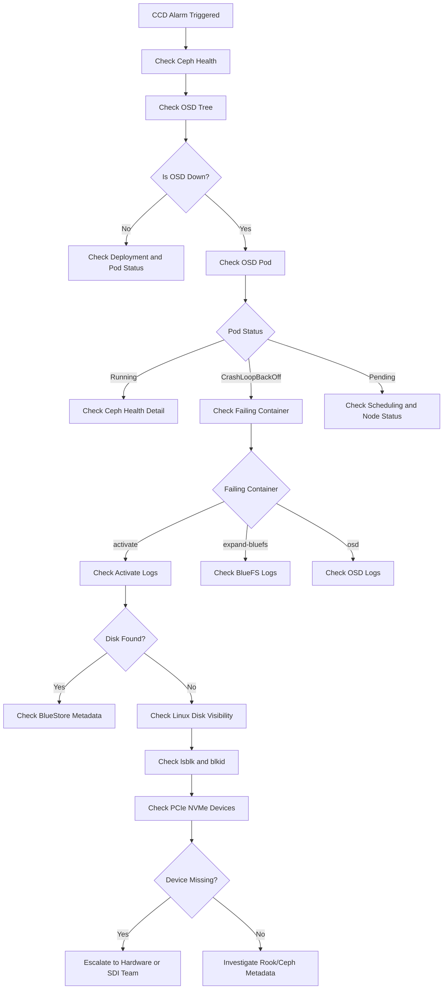
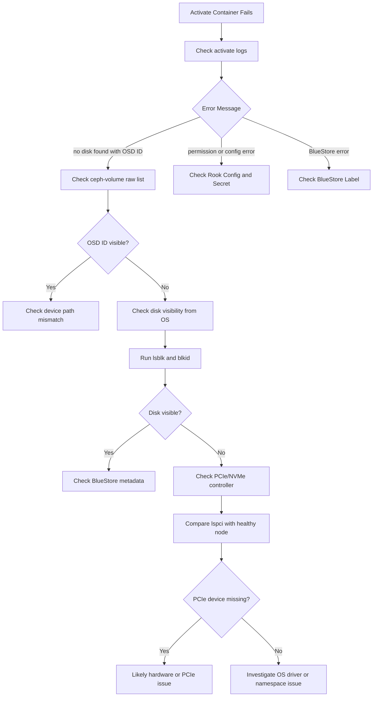

# Ceph OSD Troubleshooting Guide

A practical troubleshooting guide for diagnosing Ceph OSD issues in Kubernetes and Rook-Ceph environments.

This guide focuses on common production symptoms such as:

- OSD down
- Rook-Ceph OSD pod CrashLoopBackOff
- Activate container failure
- Missing disk or BlueStore metadata
- PCIe or NVMe detection issues
- Disk and hardware escalation

---

## Troubleshooting Flow



---

## Quick Triage Commands

### Ceph Health

```bash
ceph -s
ceph health detail
ceph osd tree
ceph osd status
ceph osd df tree
```

### Kubernetes Pod Check

```bash
kubectl get pods -n rook-ceph | grep osd
kubectl describe pod <pod-name> -n rook-ceph
kubectl logs <pod-name> -n rook-ceph -c activate --previous
```

### Linux Storage Check

```bash
lsblk
lsblk -f
blkid
lspci | grep -i "Non-Volatile"
dmesg | grep -Ei "nvme|pci|error|timeout|reset"
```

---

## Decision Tree: Activate Container Failure



---

## Example Case Study

### Symptom

CCD alarm reported:

```text
Deployment rook-ceph-osd-21 in namespace rook-ceph is running less than desired replicas 0/1.
```

### Findings

- OSD 21 was down.
- The OSD pod failed during the activate init container.
- Activate logs showed:

```text
no disk found with OSD ID 21
```

- `ceph-volume raw list` detected only other OSDs.
- The expected NVMe device was not visible from the OS.
- PCIe comparison with a healthy worker showed one missing NVMe controller.

### Conclusion

The issue was not resolved by restarting the pod. The evidence pointed toward a disk, PCIe, or hardware-level detection issue.

---

## Important Notes

- Do not manually edit Rook-generated OSD deployments unless advised.
- Restarting the pod only helps if the disk and metadata are still available.
- If the activate container cannot find the OSD disk, always verify Linux disk visibility and PCIe detection.
- Compare with a healthy node whenever possible.
- Escalate to the hardware or SDI team with evidence from Ceph, Kubernetes, Linux, and PCIe checks.
