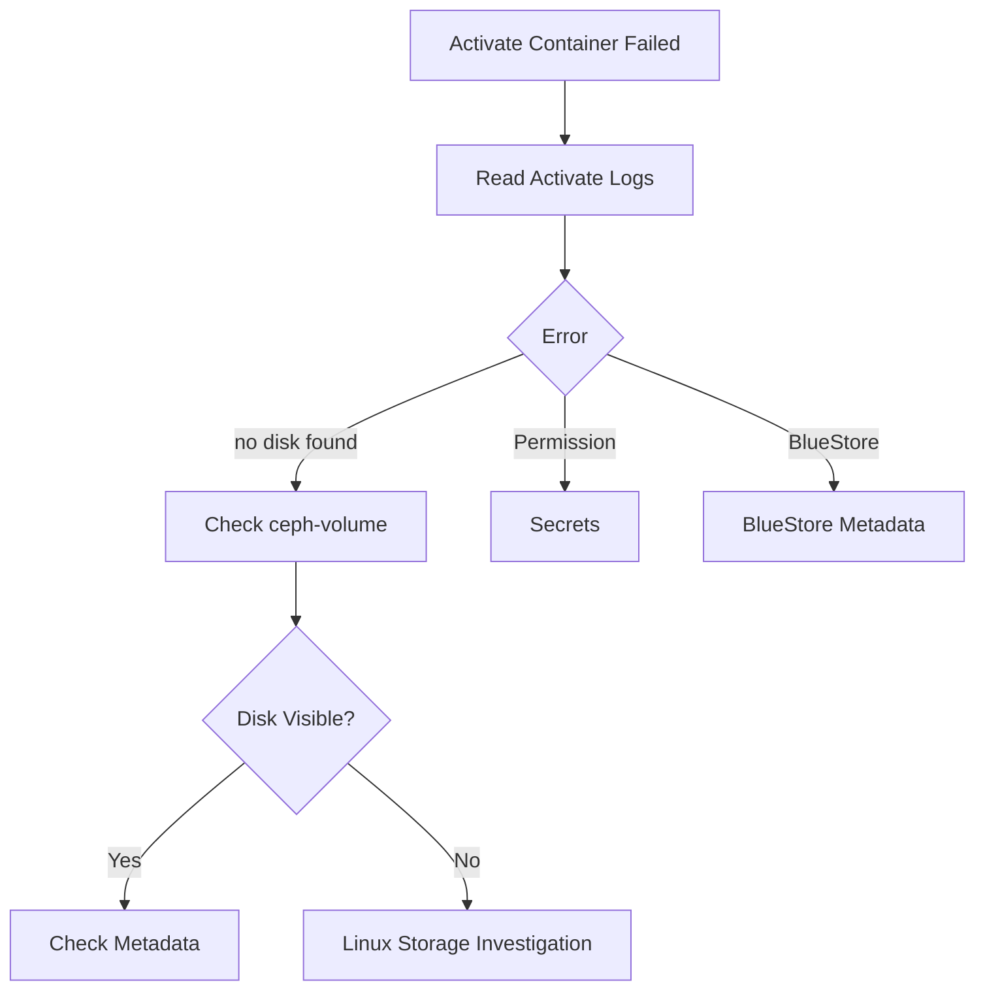

# Activate Container Decision Tree

```mermaid
flowchart TD

A[Activate Container Failed]

--> B[Read Activate Logs]

--> C{Error}

C -->|"no disk found"| D[Check ceph-volume]

C -->|Permission| E[Secrets]

C -->|BlueStore| F[BlueStore Metadata]

D --> G{Disk Visible?}

G -->|Yes| H[Check Metadata]

G -->|No| I[Linux Storage Investigation]
```
