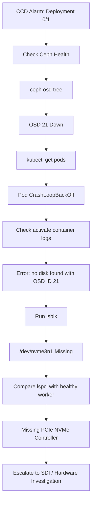

# Production Case Study

```mermaid
flowchart TD
    A[CCD Alarm: Deployment 0/1]
    --> B[Check Ceph Health]

    B --> C[ceph osd tree]

    C --> D[OSD 21 Down]

    D --> E[kubectl get pods]

    E --> F[Pod CrashLoopBackOff]

    F --> G[Check activate container logs]

    G --> H["Error: no disk found with OSD ID 21"]

    H --> I[Run lsblk]

    I --> J["/dev/nvme3n1 Missing"]

    J --> K[Compare lspci with healthy worker]

    K --> L[Missing PCIe NVMe Controller]

    L --> M[Escalate to SDI / Hardware Investigation]
```
