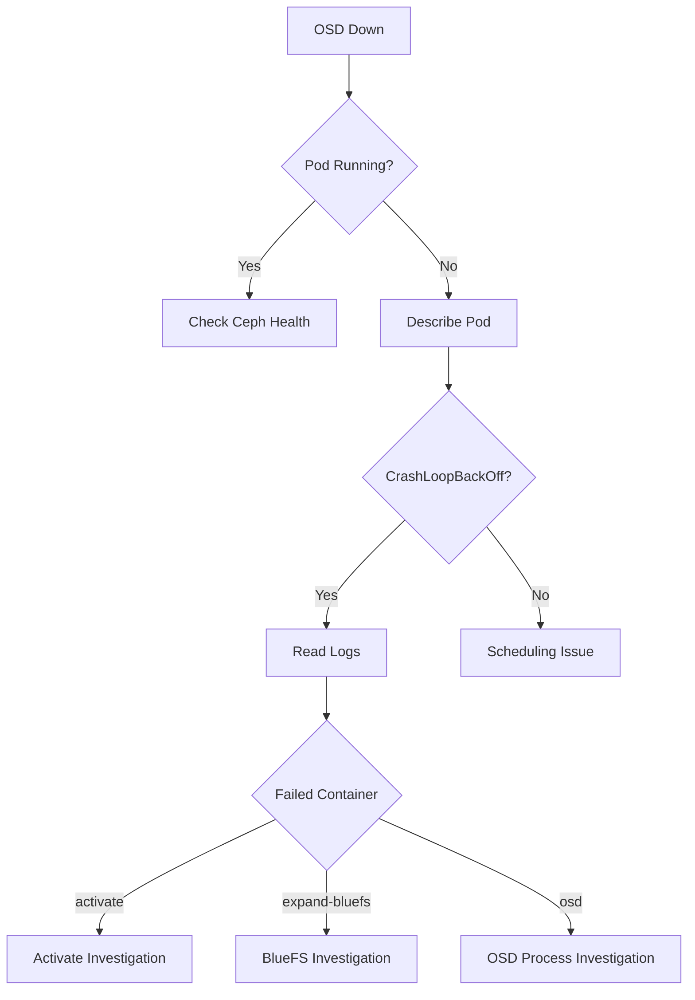

# OSD Down Decision Tree

```mermaid
flowchart TD

A[OSD Down]

--> B{Pod Running?}

B -->|Yes| C[Check Ceph Health]

B -->|No| D[Describe Pod]

D --> E{CrashLoopBackOff?}

E -->|Yes| F[Read Logs]

E -->|No| G[Scheduling Issue]

F --> H{Failed Container}

H -->|activate| I[Activate Investigation]

H -->|expand-bluefs| J[BlueFS Investigation]

H -->|osd| K[OSD Process Investigation]
```
