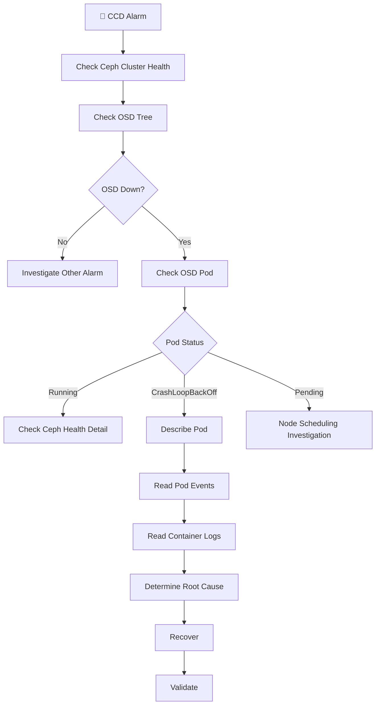

# Overall Troubleshooting Workflow

```mermaid
flowchart TD

A[🚨 CCD Alarm]

--> B[Check Ceph Cluster Health]

--> C[Check OSD Tree]

--> D{OSD Down?}

D -->|No| E[Investigate Other Alarm]

D -->|Yes| F[Check OSD Pod]

F --> G{Pod Status}

G -->|Running| H[Check Ceph Health Detail]

G -->|CrashLoopBackOff| I[Describe Pod]

G -->|Pending| J[Node Scheduling Investigation]

I --> K[Read Pod Events]

K --> L[Read Container Logs]

L --> M[Determine Root Cause]

M --> N[Recover]

N --> O[Validate]
```
